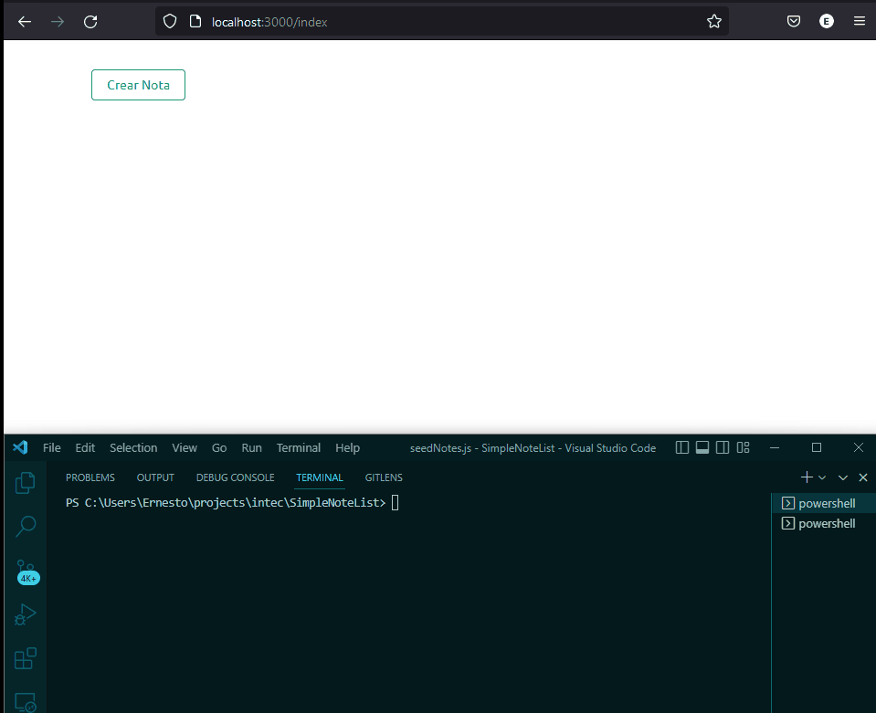

# Práctica Aplicación de 12 Factores

La presente práctica busca que cada estudiante ponga en práctica varios de los conceptos de Aplicación de 12 factores o _12 Factors App_. Se tiene un proyecto escrito en Node.JS el cual es una simple aplicación de tomar notas. La misma utiliza un servidor MongoDB para almacenar los datos.

El proyecto, aunque vistoso, es un proyecto poco maduro; por ello se solicita a cada estudiante el que implemente los siguientes principios.

1. Repositorio (_code base_).
2. Dependencias. - listo
3. Configuración. - listo
4. Servicios de Apoyo. - listo
5. Exposición de Puertos. - listo
6. Concurrencia. - listo
7. Procesos Administrativos. - listo

En cuanto a algunos puntos: **4. Servicios de Apoyo**) Se espera que se considere MongoDB como un servicio de apoyo, pues ha de correr contra cualquier servidor MongoDB sin fricción alguna. **6. Concurrencia**) Node.JS es un _nodo_, dígase que corre en una única tarea, por lo que se insta a cada estudiante a ejecutarlo en modo clúster. **7. Procesos Administrativos**) Nótese en la grabación adjunta que se cargan algunas notas vía consola; se solicita que los datos en `notes.json` sean cargados mediante un script.

Las dependencias utilizadas son:
- Express
- Pug
- Mongoose
- Body-Parser

Está práctica tiene un valor de 5 puntos, que equivalen al porcentaje de completitud de la práctica misma.